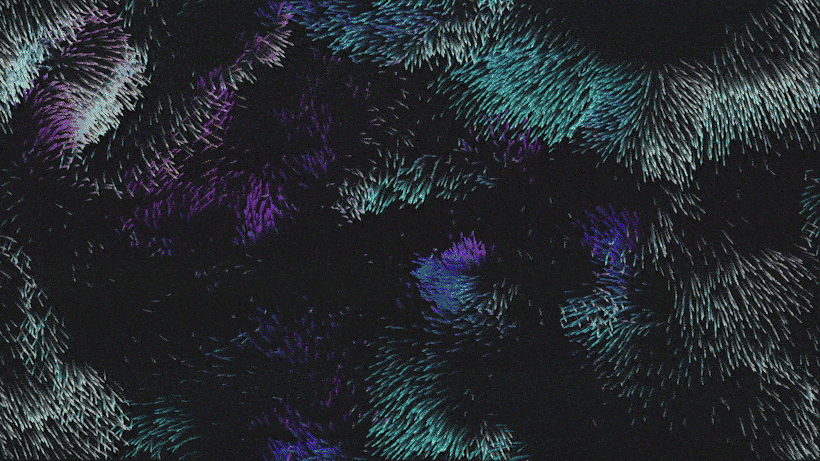
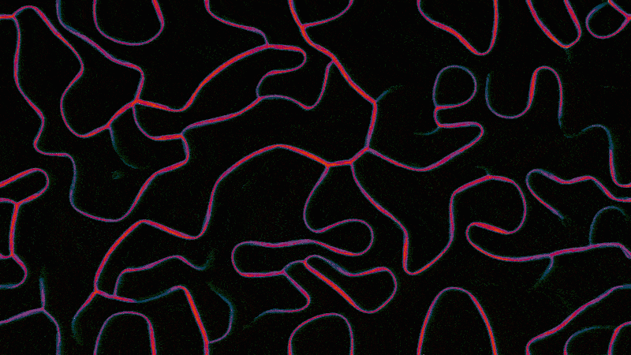
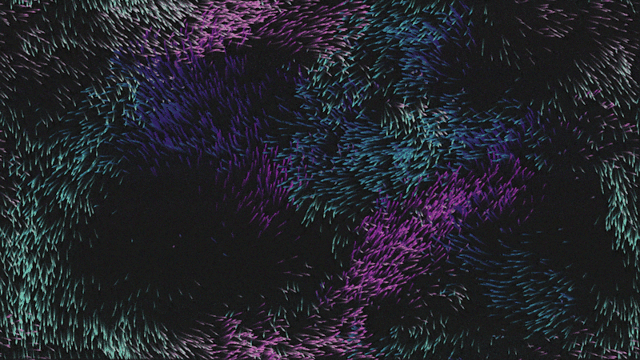
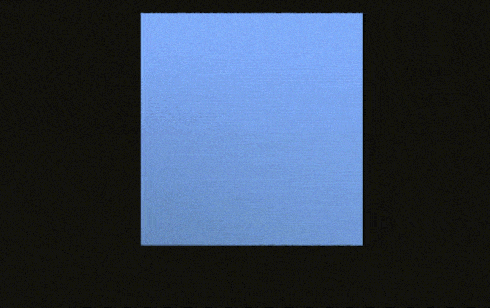
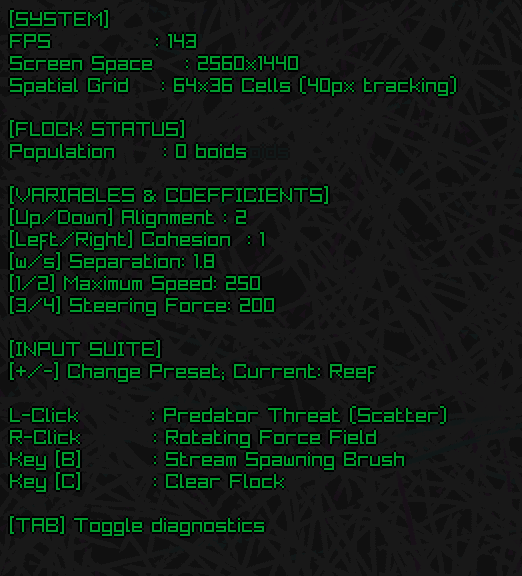

<h1 align="center">Computational Sandbox</h1>

<p align="center">
  Interactive simulations of emergent systems, collective behavior, and physical dynamics.
</p>

<p align="center">
  <strong>C# · Raylib · GLSL · Parallel Computing</strong>
</p>

<p align="center">
  
</p>

## Slime Mold

<p align="center">
  
</p>

Agents navigate a shared pheromone field using directional sensing and local feedback. Agent updates run in parallel on the CPU while GLSL passes handle trail diffusion and animated palette rendering.

- **80,000 simulated agents**
- Parallel agent updates
- GPU-based diffusion and post-processing
- Interactive pheromone deposition and erasing
- Multiple behavior presets

## Flocking

<p align="center">
  
</p>

5,000 boids form dynamic flocking patterns through alignment, cohesion, separation, and wandering behaviors.

A spatial grid limits neighbor searches to nearby cells, avoiding a slow all-pairs comparison across the entire flock.

- Alignment, cohesion, and separation steering
- Spatial-grid neighborhood lookup
- Interactive forces and spawning
- Live parameter tuning
- Behavior presets

## Verlet Cloth

<p align="center">
  
</p>

A deformable cloth mesh built from 22,500 particles and structural constraints using Verlet integration and iterative constraint relaxation.

- 150 × 150 particle mesh
- Verlet integration
- Parallelized constraint solving
- Interactive dragging and cutting
- Dynamic tearing under excessive strain
- Real-time diffuse shading

## About the Sandbox

Computational Sandbox is a collection of interactive visual simulations built around a shared simulation framework.

The project explores how computational systems can be made visible and manipulable in real time, with an emphasis on performance, interaction, and emergent behavior.

Each simulation inherits from a common lifecycle that handles:

- Initialization and cleanup
- Frame timing
- Update/render loops
- Shared diagnostics
- Common input behavior

## Live Diagnostics



Each simulation exposes live system and simulation state through a shared diagnostic overlay, including FPS, population size, simulation parameters, mesh statistics, and controls.

Press `Tab` to toggle diagnostics.

<details>
<summary><strong>Controls</strong></summary>

### Global

| Input | Action |
|---|---|
| `Tab` | Toggle diagnostics |
| `Esc` | Exit |

### Slime Mold

| Input | Action |
|---|---|
| Left click | Deposit pheromones |
| Right click | Erase trails |
| `+ / -` | Change preset |
| Arrow keys / `W` / `S` | Adjust simulation parameters |

### Flocking

| Input | Action |
|---|---|
| Left click | Scatter flock |
| Right click | Apply rotating force |
| `B` | Spawn boids |
| `C` | Clear flock |
| `+ / -` | Change preset |

### Cloth

| Input | Action |
|---|---|
| Left drag | Cut cloth |
| Right drag | Grab cloth |
| `R` | Restore cloth |
| `S` | Settle cloth |

</details>

## Technical Highlights

- **Spatial partitioning:** Flocking uses a grid-based neighborhood search instead of checking every boid against every other boid.
- **Parallel simulation:** CPU-heavy agent and constraint workloads use .NET parallelism.
- **Hybrid CPU/GPU pipeline:** Slime Mold combines CPU agent simulation with GLSL-based diffusion and palette rendering.
- **Constraint-based cloth:** Cloth dynamics use Verlet integration with iterative structural constraint relaxation.
- **Shared simulation framework:** All demos use a common lifecycle and diagnostic system.

## Running

### Requirements

- .NET 10 SDK
- OpenGL-capable GPU

Clone the repository:

```bash
git clone https://github.com/amster11722/Computational-Sandbox.git
cd ComputationalSandbox

dotnet run --project src/App-Boids
dotnet run --project src/App-SlimeMold
dotnet run --project src/App-VerletCloth
```

